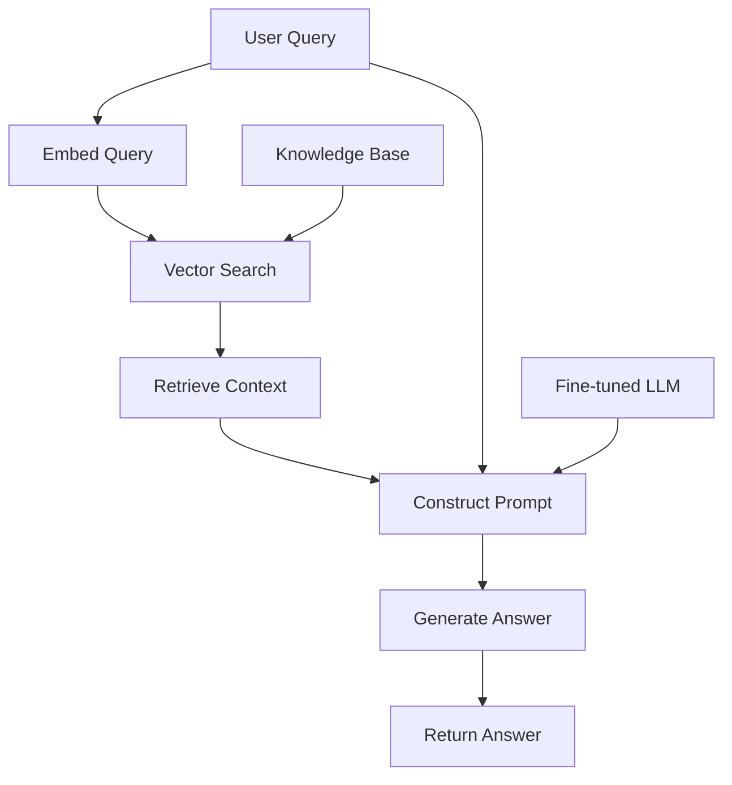

# Healthcare RAG Q&A System with Vertex AI 🏥

A domain-specific Retrieval-Augmented Generation (RAG) system for healthcare questions, built on Google Cloud Vertex AI. This project demonstrates how to build an end-to-end RAG pipeline with a focus on medical information using open-source healthcare data.

## Project Overview 🏥

This project implements a RAG system for healthcare Q&A using the following components:

1. **Data Processing**: Uses the MedQuAD (Medical Question Answering Dataset) to fine-tune a model and build a knowledge base.
2. **Model Fine-tuning**: Fine-tunes Flan-T5 on healthcare question-answer pairs using Vertex AI Training.
3. **Vector Search**: Creates a vector index of healthcare information using Vertex AI Vector Search.
4. **Web Application** 🌐: A Flask backend with simple UI for user to ask healthcare questions.

## Workflow Diagram 📈

Here's a visual representation of the RAG workflow:



## Setup & Installation ⚙️

### Prerequisites

- Google Cloud Platform account with billing enabled
- Google Cloud SDK installed and configured
- Python 3.8+

### Environment Setup

1. Clone this repository
   ```bash
   git clone <repository-url>
   cd healthcare-rag
   ```

2. Create a virtual environment
   ```bash
   python -m venv venv
   source venv/bin/activate  # On Windows: venv\Scripts\activate
   ```

3. Install dependencies
   ```bash
   pip install -r requirements.txt
   ```

4. Set up environment variables (copy from sample)
   ```bash
   cp .env.sample .env
   # Edit .env file with your GCP project details
   ```

### Google Cloud Setup

```bash
# Set your project ID and region
PROJECT_ID="your-gcp-project-id"
REGION="us-central1"
gcloud config set project $PROJECT_ID

# Enable necessary APIs
gcloud services enable vertexai.googleapis.com storage.googleapis.com pubsub.googleapis.com run.googleapis.com

# Create a Cloud Storage bucket
BUCKET_NAME="${PROJECT_ID}-rag-bucket"
gsutil mb -l $REGION -p $PROJECT_ID gs://$BUCKET_NAME
```

## Project Structure 📁

```
├── data/                      # Data directory
│   ├── raw/                   # Raw data storage
│   ├── processed/             # Processed data
│   └── docs/                  # Documentation
├── src/                       # Source code
│   ├── app/                   # Flask application
│   │   ├── templates/         # HTML templates
│   │   └── app.py             # Flask app
│   ├── data_prep.py           # Data preparation scripts
│   ├── model_training/        # Model training code
│   │   ├── trainer.py         # Training script
│   │   └── vertex_ai_ops.py   # Vertex AI operations
│   └── vector_search/         # Vector search operations
├── .env.sample               # Sample environment variables
├── .gitignore                # Git ignore file
├── requirements.txt          # Python dependencies
└── README.md                 # Project documentation
```

## Development Workflow 🚀

### Git Workflow

1. Create a new branch for each feature or bugfix
   ```bash
   git checkout -b feature/new-feature
   ```

2. Commit changes after completing a component
   ```bash
   git add .
   git commit -m "Add feature: description of changes"
   ```

3. Push to remote repository
   ```bash
   git push origin feature/new-feature
   ```

4. Create a pull request to merge changes into main branch

### Running the Application Locally

```bash
cd src/app
flask run --port=8080
```

## Deployment ☁️

### Deploy to Cloud Run

```bash
# Build the container image
gcloud builds submit --tag gcr.io/$PROJECT_ID/healthcare-rag:latest .

# Deploy to Cloud Run
gcloud run deploy healthcare-rag-service \
  --image gcr.io/$PROJECT_ID/healthcare-rag:latest \
  --platform managed \
  --region $REGION \
  --allow-unauthenticated \
  --set-env-vars=PROJECT_ID=$PROJECT_ID,REGION=$REGION,BUCKET_NAME=$BUCKET_NAME
```

## License 📄

This project is licensed under the MIT License - see the LICENSE file for details.
